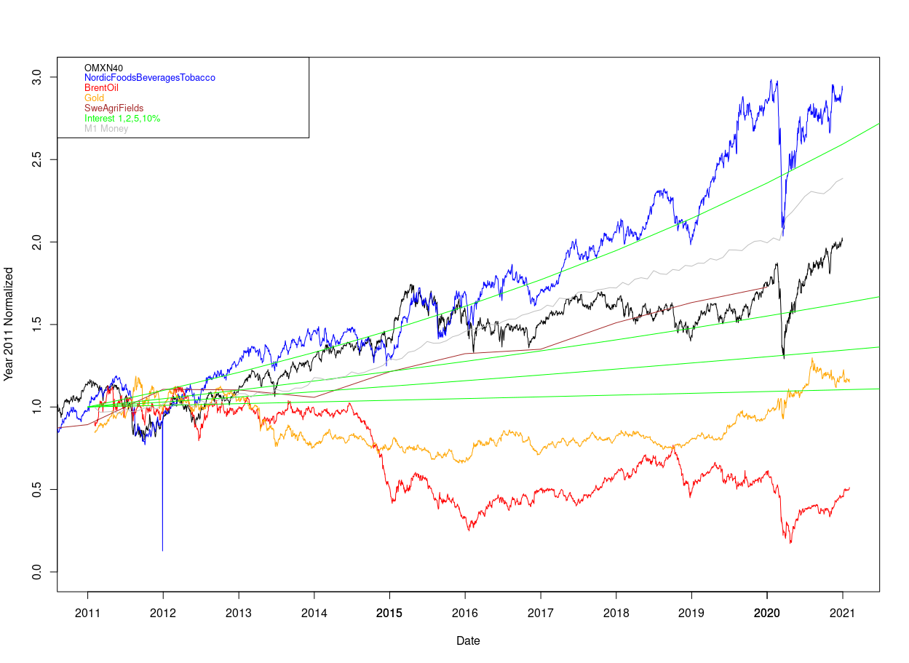
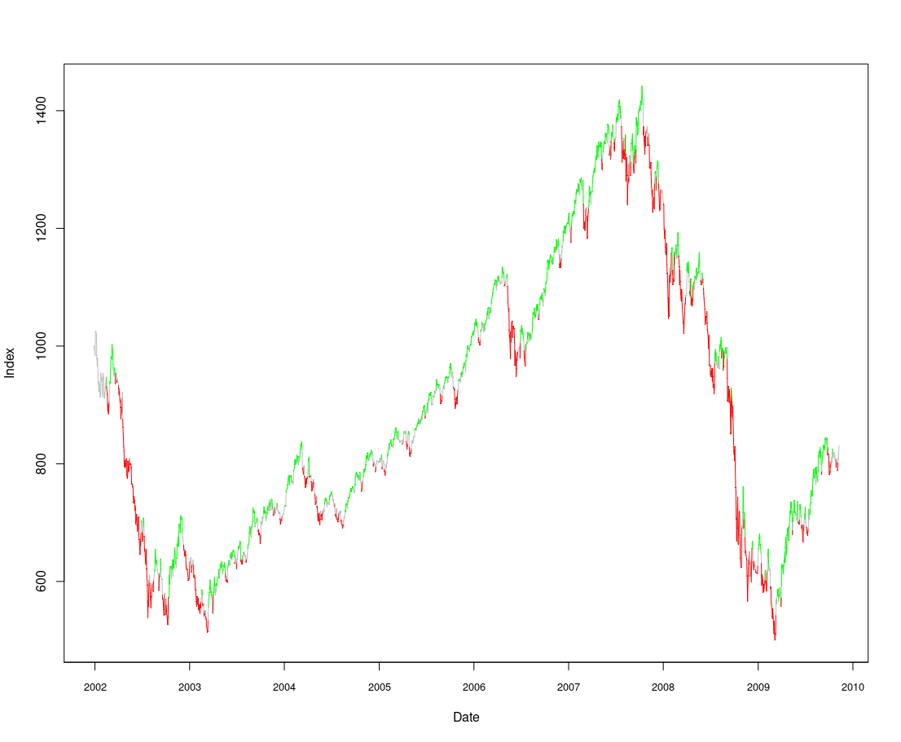
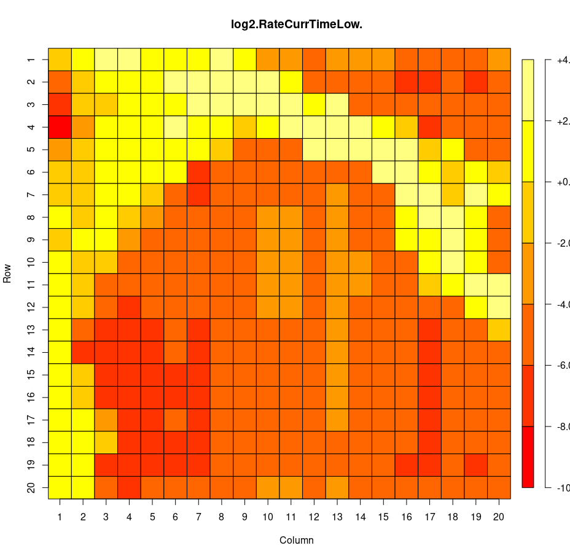
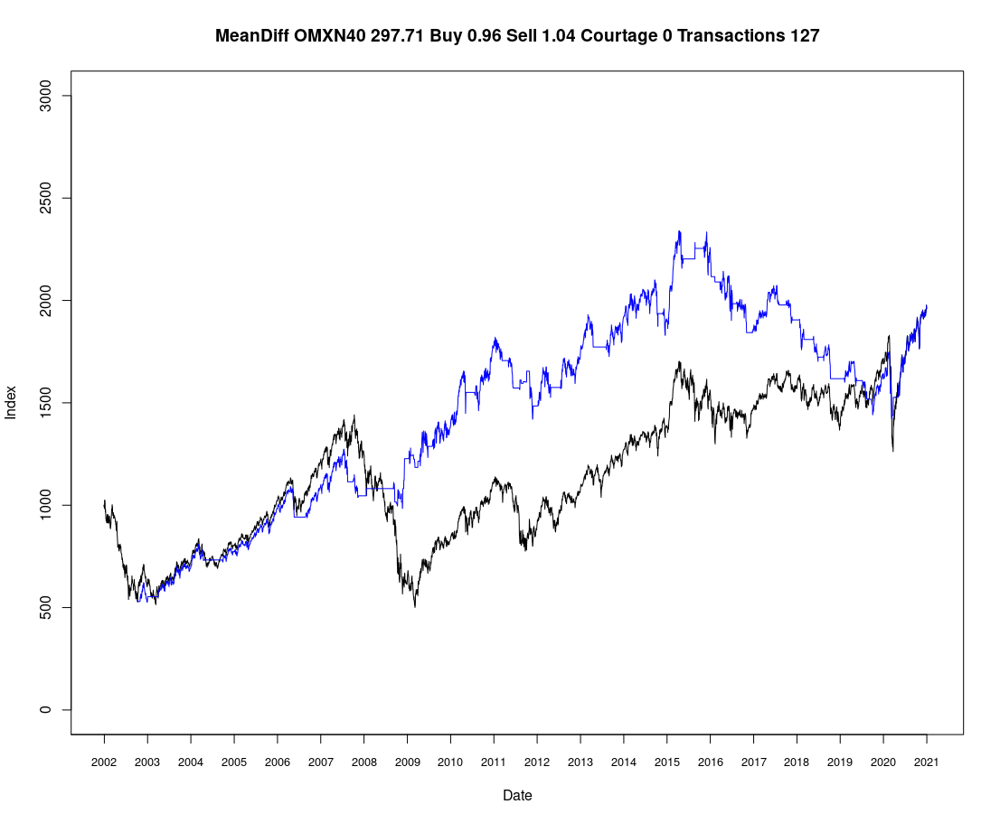
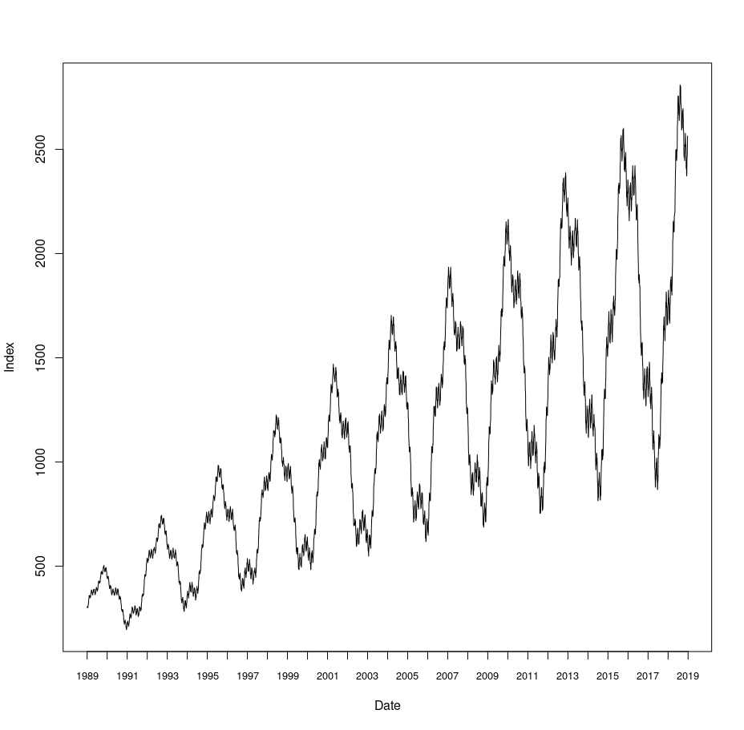
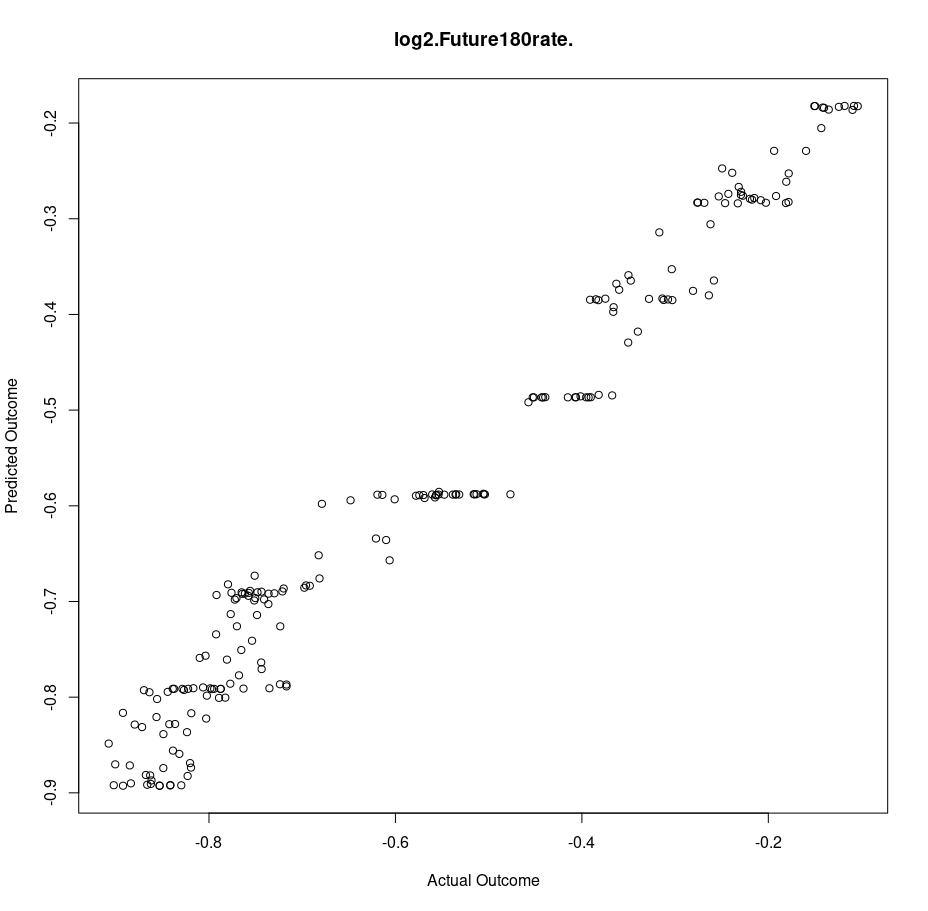
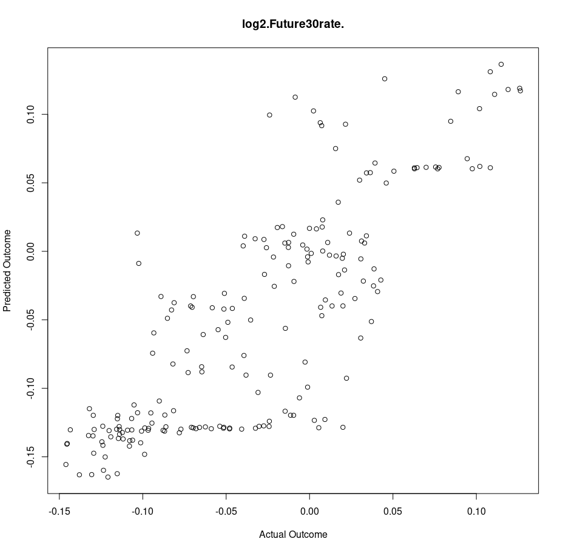
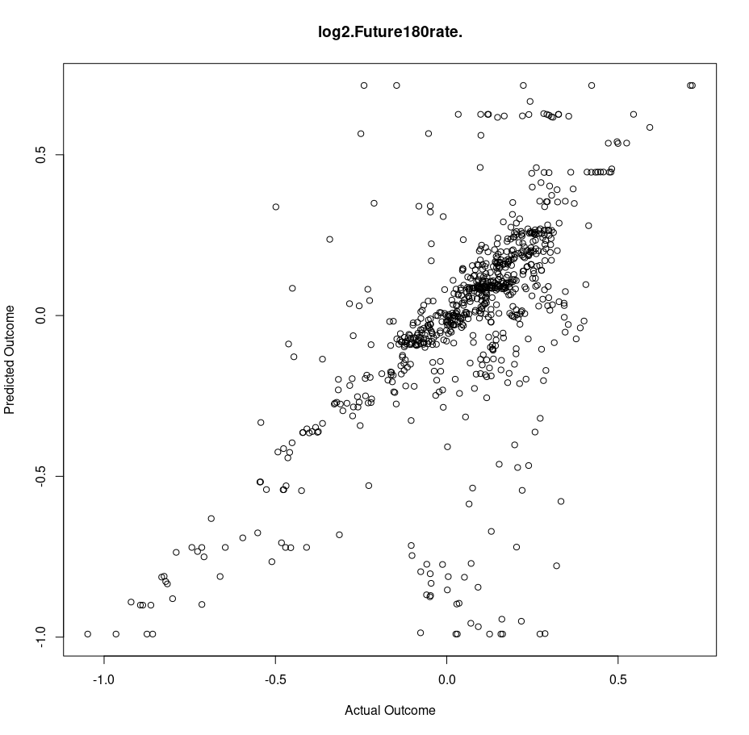
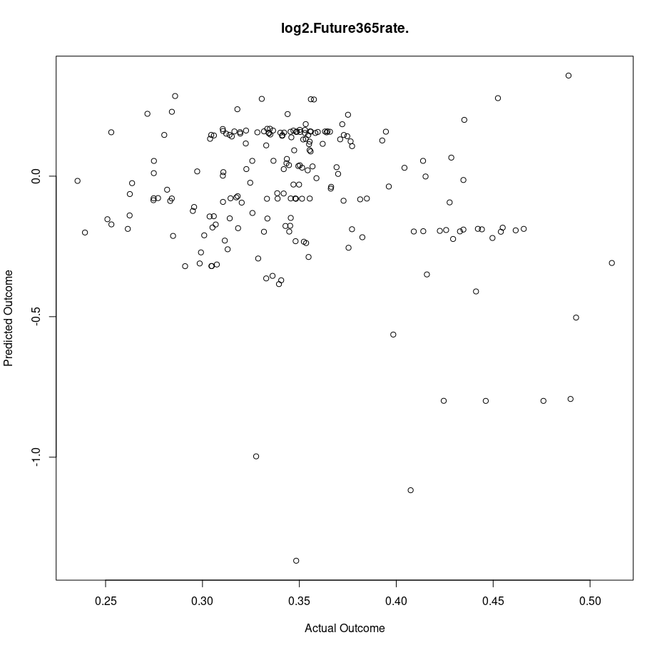

# MapRegression

This project is in preliminary beta-version and sketches an outline how to model and predict highly non-linear and possibly cyclic time series using base-R coding. Hence without any use artificial neural networks, or Fourier transform. Examples of such data are seasonal temperatures and price data, for examples stock market data, which the project focus on. Workflow below:

## Prices of assets

Data of stocks, land prices, oil, gold etc. were collected from various sources normalized to 2011 average. Ideal interest rates added for comparison.\
The MapRegression model structure could be adapted to find patterns between different assets but focus on single asset internal modeling. 

The dip in Nordicfoolds... index is an error in the source data.

## Derivation

The model first derives several parameter for each data point using historical data relative to the data point. For example this 30 days back-trend of OMX40. 

## Mapping

The parameters are translated/mapped into a patterns used for prediction. By their mapped structure they can be combined to take into account all different parameters. Example below 180 days ahead prediction by a local resent low value in the stock market where yellow color corresponds to en expected increase in values and red a decrease. 

## Trading from Technical Analysis

The derived parameters can directly be used to test how a trading strategy would have performed by averaging several cycles of various start days. For example the stop-loss, get-gain, sell high-day, buy low-day in image below, where the blue line is the trade performance from one specific start day and black line is the OMX40 index. 

## Modeling on predicable data

Artificial noise overlaied cyclic data with the overall same growth as stock market data was generated to benchmark the function of MapRegression, which automatically attempts to find parameters that could be used for prediction/trading.

## Correlation on artificial data

The method of MapRegression managed to find a model that fares quite well predicting 180-days ahead, but somewhat worse predicting the 30-days ahead outcomes.

## Correlation on OMX40 data. Time internal evaluation set.

The correlation becomes worse for real stock market index data predicting 180 days ahead, but still there is a quite clear line of correlation. 

## Correlation on OMX40 data. Time external evaluation set.

The 180-days head prediction fails when the evaluation data set is more recent than the data set used for building the model. This means the model can somewhat estimate the future outcome, but only internally within the time frame of the data used for the model construction. This is different from modelling the artificial data, which can be predicted ahead of the time frame used to build the model. Non excluding explanations could be over-fitting of the model and the likely inherent unpredictability of the stock market index.
